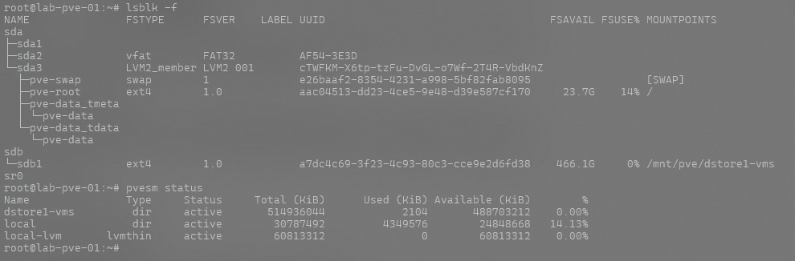
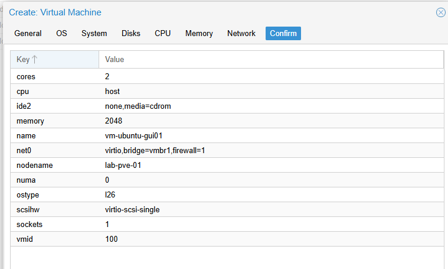
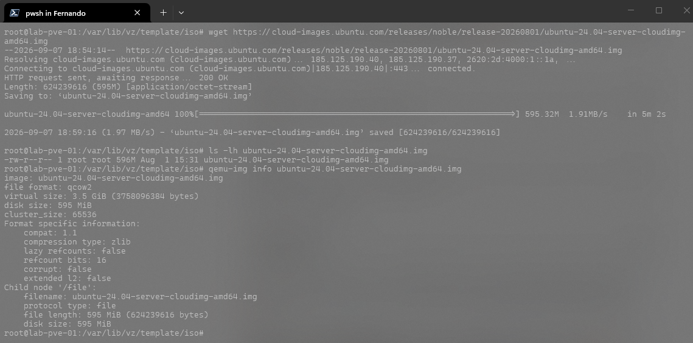
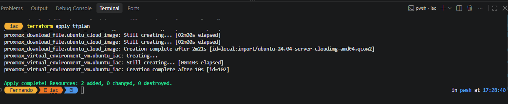
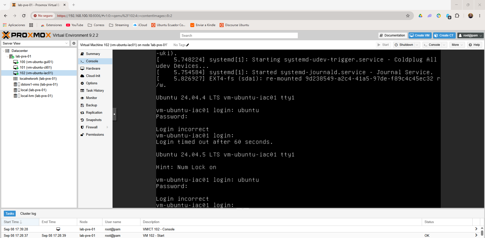

# Lab 01 — VM Deployment & Automation

### Proxmox VE · Ubuntu Cloud Image · Cloud-Init · CLI · REST API · Terraform · VS Code

**Autor:** Darwin Proaño Orellana  
**Serie:** Proxmox VE Engineering Labs

---

## 🎯 Objetivo

Este laboratorio documenta diferentes métodos de creación y aprovisionamiento de máquinas virtuales en **Proxmox VE**, partiendo desde métodos tradicionales de administración hasta automatización mediante API.

El objetivo fue comprender progresivamente el flujo de aprovisionamiento:

**GUI → CLI → Cloud Image → Cloud-Init → REST API → Terraform → Automated Deployment**

El laboratorio fue desarrollado en un entorno de pruebas sobre **Proxmox VE 9.2 ejecutándose dentro de VMware Workstation**, utilizando una imagen cloud de Ubuntu Server.

---

## 🧪 Escenario del laboratorio

El entorno utilizado para esta práctica incluye:

- Proxmox VE 9.2
- VMware Workstation
- Ubuntu Server 24.04 Cloud Image
- Cloud-Init
- Proxmox CLI (`qm`)
- Proxmox REST API
- Visual Studio Code
- REST Client Extension

El laboratorio fue diseñado para practicar diferentes métodos de aprovisionamiento y documentar el proceso completo de implementación.

---

## 🏗️ Arquitectura general

```text
Windows 11 Host
│
└── VMware Workstation
    │
    └── Proxmox VE 9.2
        │
        ├── vmbr0 → NAT / Internet
        │
        ├── vmbr1 → Internal Lab Network
        │
        └── dstore1-vms
            │
            ├── Ubuntu Cloud Image
            ├── VM 100
            └── VM 101
    └── VM 101
```

---

## 💾 Diseño de almacenamiento | Storage Design

Para el laboratorio se configuró un almacenamiento dedicado denominado `dstore1-vms`, destinado a alojar las imágenes y discos de las máquinas virtuales utilizadas durante las prácticas.

Se utilizó almacenamiento basado en directorio en lugar de LVM, buscando mantener una estructura sencilla, portable y fácilmente respaldable.

El almacenamiento `dstore1-vms` contiene los recursos utilizados durante el laboratorio, incluyendo la Ubuntu Cloud Image y los discos de las máquinas virtuales creadas.

### Evidencia



---

## 🖥️ Creación de máquina virtual mediante GUI | GUI Deployment

Como punto de partida se utilizó la interfaz gráfica de **Proxmox VE** para revisar y comprender los principales parámetros involucrados en la creación y configuración de una máquina virtual.

Este método permite visualizar directamente elementos como CPU, memoria, almacenamiento, interfaces de red y opciones generales de hardware antes de avanzar hacia métodos de aprovisionamiento mediante CLI y automatización.

La utilización inicial de la GUI permitió establecer una referencia para comparar posteriormente los mismos procesos ejecutados mediante herramientas de línea de comandos y automatización.

### Evidencia



---

## ☁️ Ubuntu Cloud Image y Cloud-Init | Cloud Image Deployment

Para agilizar el aprovisionamiento de máquinas virtuales se utilizó una **Ubuntu Server 24.04 Cloud Image**, evitando realizar una instalación tradicional del sistema operativo desde una imagen ISO.

La imagen cloud fue importada al almacenamiento `dstore1-vms` y posteriormente utilizada como disco base de las máquinas virtuales del laboratorio.

El uso de **Cloud-Init** permite definir parámetros iniciales de la instancia, como configuración de red, usuario y otras opciones de inicialización, facilitando la creación repetible de máquinas virtuales.

Este enfoque representa una evolución desde la instalación manual hacia mecanismos de aprovisionamiento más adecuados para automatización e Infrastructure as Code.

### Evidencia



---

## 🔌 Automatización mediante REST API | REST API Automation

Después de validar los métodos tradicionales de administración, el laboratorio avanzó hacia la interacción programática con **Proxmox VE mediante su REST API**.

Desde **Visual Studio Code**, utilizando REST Client, se realizaron solicitudes hacia la API de Proxmox para comprobar la posibilidad de administrar y aprovisionar recursos sin depender exclusivamente de la interfaz gráfica.

Para la autenticación se utilizó un **API Token**, evitando incluir credenciales administrativas directamente dentro de las solicitudes.

> ⚠️ Los tokens, secretos y credenciales utilizados durante el laboratorio no se almacenan en este repositorio.

Esta etapa permitió comprender cómo las operaciones realizadas desde la GUI pueden trasladarse hacia flujos automatizados y reproducibles.

---

## 🧩 Infrastructure as Code | Terraform

Como evolución del proceso de automatización se incorporó **Terraform** para representar la infraestructura mediante archivos declarativos.

El objetivo fue comprobar cómo una máquina virtual puede definirse como código y posteriormente ser aprovisionada sobre Proxmox VE, reduciendo la dependencia de configuraciones manuales.

El flujo utilizado durante esta etapa fue:

**Terraform configuration → Proxmox API → VM provisioning**

Este enfoque introduce conceptos fundamentales de **Infrastructure as Code (IaC)**, permitiendo que las configuraciones puedan ser documentadas, versionadas y posteriormente reutilizadas.

### Evidencia



---

## ✅ Validación del aprovisionamiento | Deployment Validation

Finalmente se verificó en **Proxmox VE** que la máquina virtual definida mediante el proceso de automatización fue creada correctamente.

La validación permitió comprobar que los parámetros enviados mediante el flujo automatizado fueron procesados por Proxmox y dieron como resultado una nueva máquina virtual dentro del entorno del laboratorio.

Esta prueba cierra el flujo progresivo desarrollado durante el Lab 01:

**GUI → CLI → Cloud Image → Cloud-Init → REST API → Terraform → Automated Deployment**

### Evidencia



---

## 🧠 Lecciones aprendidas | Lessons Learned

Este laboratorio permitió recorrer progresivamente diferentes niveles de administración y aprovisionamiento dentro de Proxmox VE, comenzando con métodos manuales y avanzando hacia automatización e Infrastructure as Code.

Entre los principales aprendizajes obtenidos se encuentran:

- Comprensión de la estructura básica de una VM en Proxmox VE.
- Administración y configuración mediante GUI y CLI.
- Diseño de almacenamiento basado en directorio para facilitar portabilidad y respaldo.
- Importación y utilización de Ubuntu Cloud Images.
- Aprovisionamiento inicial mediante Cloud-Init.
- Interacción con Proxmox mediante REST API.
- Uso de API Tokens para automatización.
- Introducción de Terraform como herramienta de Infrastructure as Code.
- Validación y troubleshooting durante procesos de aprovisionamiento.

El objetivo principal no fue únicamente conseguir que una máquina virtual funcionara, sino comprender **cómo evolucionar desde una implementación manual hacia un proceso de infraestructura automatizado, documentado y reproducible**.

---

## 🔐 Consideraciones de seguridad | Security Considerations

Las credenciales, contraseñas, API Tokens y demás información sensible utilizada durante las pruebas fueron excluidas de la documentación pública.

El repositorio está diseñado para contener únicamente configuraciones, documentación y evidencias que puedan ser compartidas públicamente sin revelar información sensible del entorno utilizado durante el laboratorio.

> **Never commit credentials, API tokens, passwords or private infrastructure information to a public repository.**

---

## 🏁 Resultado | Result

El **Lab 01 — VM Deployment & Automation** permitió implementar y documentar satisfactoriamente un flujo progresivo de aprovisionamiento de máquinas virtuales sobre Proxmox VE.

El laboratorio evolucionó desde la administración mediante interfaz gráfica hasta mecanismos de automatización e Infrastructure as Code, estableciendo una base para futuros escenarios más avanzados de networking, almacenamiento, seguridad y automatización dentro de la serie **Proxmox VE Engineering Labs**.

**Status:** 🟢 Completed
